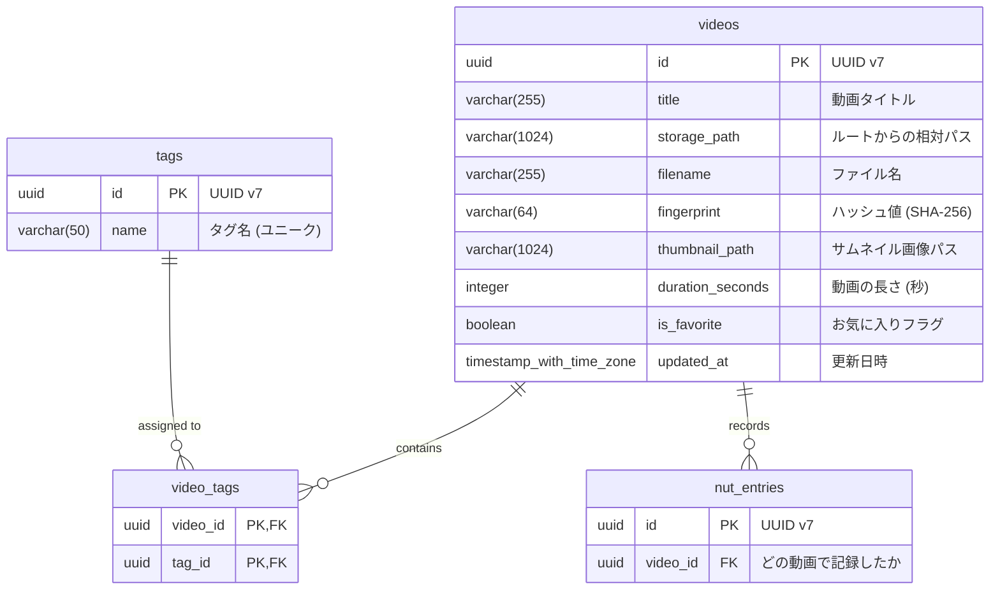

# データベース設計書：Doga

『要件定義書：Doga』に基づき、PostgreSQLを使用したデータベース構造を定義します。

## 1. エンティティ関連図 (ERD)

## 2. テーブル定義詳細

### 2.1 videos (動画基本情報)

メインの動画メタデータを管理します。

| カラム名 | 型 | 制約 | 説明 |
| :--- | :--- | :--- | :--- |
| `id` | `uuid` | PRIMARY KEY | UUID v7 (時系列ソート可能) |
| `title` | `varchar(255)` | NOT NULL | 画面表示用のタイトル |
| `storage_path` | `varchar(1024)` | NOT NULL | ルートディレクトリからの構成パス |
| `filename` | `varchar(255)` | NOT NULL | 拡張子を含むファイル名 |
| `fingerprint` | `varchar(64)` | NOT NULL, UNIQUE | ファイルのハッシュ値 (SHA-256) |
| `thumbnail_path` | `varchar(1024)` | | 自動生成されたサムネイルへのパス |
| `duration_seconds` | `integer` | | 動画の長さ（秒） |
| `is_favorite` | `boolean` | NOT NULL, DEFAULT false | お気に入り状態 |
| `updated_at` | `timestamptz` | NOT NULL, DEFAULT now() | 更新日時 |

- **制約**:
  - `UNIQUE(storage_path, filename)`: 同一パスの二重登録を防止。
  - `UNIQUE(fingerprint)`: ファイル内容ベースの重複を防止。

### 2.2 tags (タグ定義)

| カラム名 | 型 | 制約 | 説明 |
| :--- | :--- | :--- | :--- |
| `id` | `uuid` | PRIMARY KEY | UUID v7 |
| `name` | `varchar(50)` | NOT NULL, UNIQUE | タグ名 |
| `updated_at` | `timestamptz` | NOT NULL, DEFAULT now() | 更新日時 |

#### 制約・インデックス (tags)

- `UNIQUE(name)`: タグ名の重複を防止。

### 2.3 video_tags (動画・タグ中間テーブル)

多対多の関連を管理します。

#### 制約・インデックス (video_tags)

- `PRIMARY KEY (video_id, tag_id)`
- `idx_video_tags_tag_id`: `B-Tree` (タグによる絞り込みを高速化)。

### 2.4 nut_entries (ジャーナル記録)

ユーザーの「Nut」記録を保持します。

| カラム名 | 型 | 制約 | 説明 |
| :--- | :--- | :--- | :--- |
| `id` | `uuid` | PRIMARY KEY | UUID v7 |
| `video_id` | `uuid` | FK (videos.id) ON DELETE CASCADE | |

#### 制約・インデックス (nut_entries)

- `idx_nut_entries_video_id`: `B-Tree` (動画ごとの Nut 数計算用)。
- `id (PK)`: UUID v7 のため、時系列範囲検索に対応。

## 3. インデックス・制約設計

### 3.1 videos

- `idx_videos_full_path`: `UNIQUE (storage_path, filename)`
  - ストレージ上の物理パスの一意性を保証。
- `idx_videos_updated_at`: `B-Tree`
  - 「最近更新された順」でのソート性能を確保。
- `idx_videos_is_favorite`: `B-Tree`
  - お気に入りフォルダの高速表示。
- `idx_videos_title`: `B-Tree` (または `gin(tgrm)` )
  - 前方一致検索の高速化。

### 3.2 video_tags

- `idx_video_tags_tag_id`: `B-Tree`
  - 「特定のタグが付いた動画一覧」の取得を高速化。

### 3.3 nut_entries

- `idx_nut_entries_video_id`: `B-Tree`
  - 特定の動画の累計Nut数計算や、最終Nut日の取得を高速化。
- `idx_nut_entries_id`: (Primary Key)
  - UUID v7 のため、デフォルトの B-Tree で時系列範囲検索（カレンダー表示など）にそのまま対応。

## 4. 特記事項

- **ID設計**: 時系列ソートが必要なため、UUID v7を採用します。
- **ファイル管理**: `file_path` を `storage_path` と `filename` に分けることで、ボリュームマウントの変更等に強くしています。
